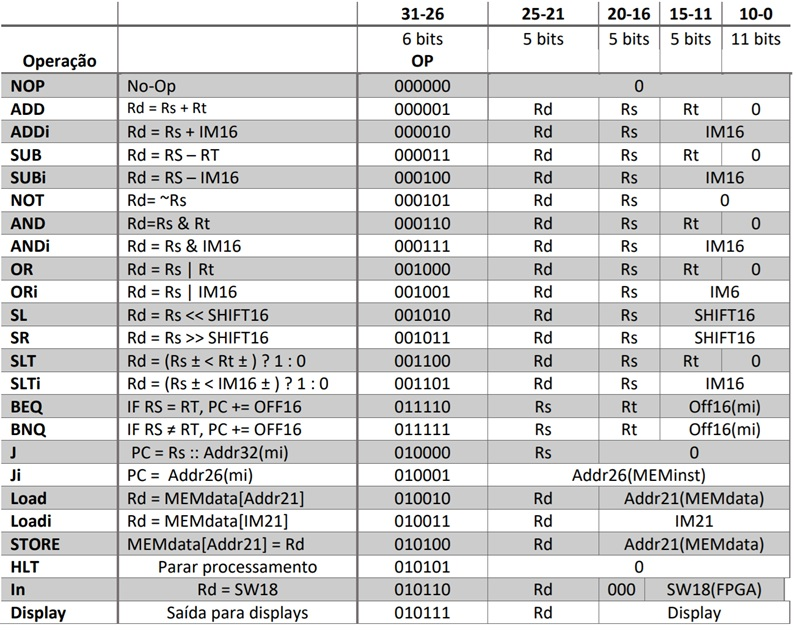
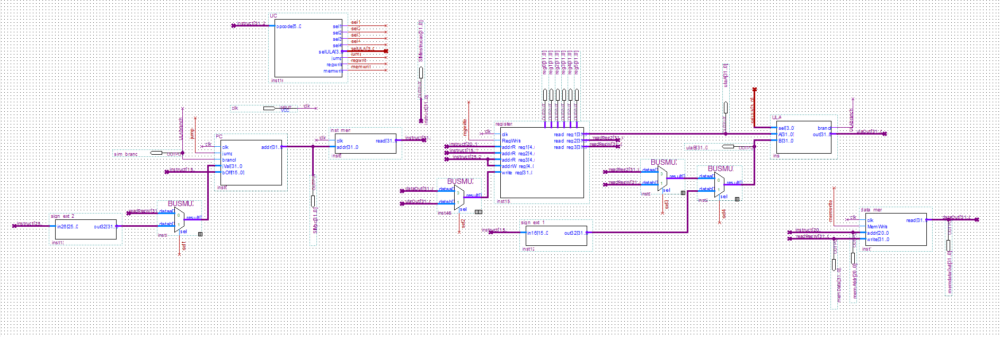

# MIPS based Processor
A 32-bit MIPS based processor written in Verilog

## Instruction Set

## Bdf

It was later converted to verilog.

## Report
[Report (In Portuguese)](docs/Report(InPortuguese).pdf "Report").
